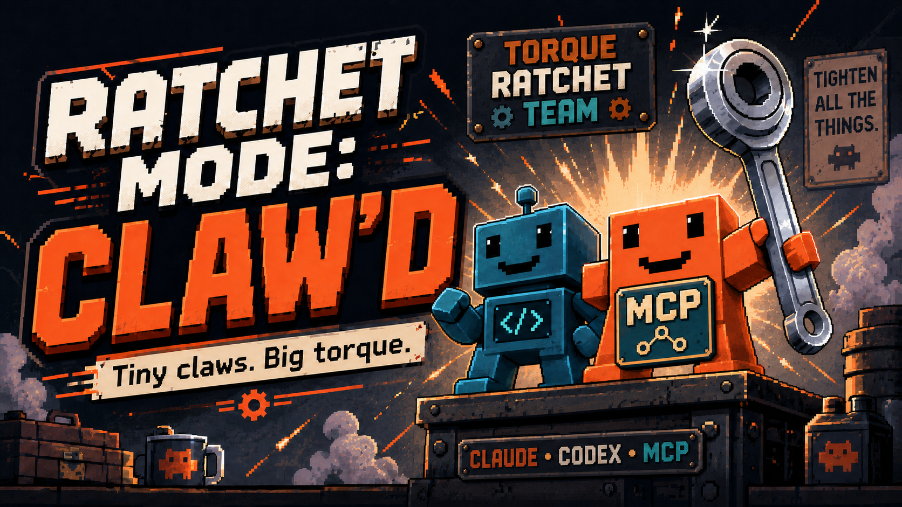

# Torque Loop

[](https://github.com/Megaprompting/torque-loop/actions/workflows/ci.yml)
[](LICENSE)
[](package.json)

**No proof → no keep.**

A Claude Code and Codex plugin — and an MCP server — that turns ambiguous work into
shipped, tested, serialized artifacts through evidence-gated loops.

> Not affiliated with, endorsed by, or sponsored by Anthropic or OpenAI.

Torque Loop is **not a prompt library.** A prompt library gives an agent better words.
Torque Loop gives it a job:

> **frame → choose → build → attack → patch → serialize → advance**

It bundles three things:

- **The Ratchet command family** (`/ratchet:*`) — 21 commands that turn ambiguity into
  shipped, falsifiable artifacts through adversarial execution loops.
- **`/ratchet:evolve`** — a narrower, bounded loop that mutates one artifact, tests it, and
  keeps only proven improvement.
- **`ratchet-mcp`** — an MCP server that serves session state to any MCP client over stdio,
  where every read is bound to a capability rather than a path you asked for.

Every command produces *pressure*, not just insight. Each one forces a choice, creates an
artifact, tests an artifact, patches a defect, serializes state, kills an option, or pushes
to a higher-yield move. Everything else is smoke.

The whole system is a one-way progress mechanism — it only turns forward, and it remembers
where it stopped. State persists to disk, so the next session resumes instead of restarting.
One command reads it back in under a minute, in the same eight sections every time:

```text
TARGET · DELTA · PROOF · VERDICT · RISK · AUTHORITY · STATE · NEXT
```

*Ambiguity in. Artifact out. Failure tested. State advanced.*

---

## Contents

- [The thesis](#the-thesis-verified-guardrails-lift-cognitive-load) — why gates lift load instead of adding it
- [Commands](#commands) — the 21 `/ratchet:*` commands and the evolve loop
- [Why seam fidelity matters](#why-seam-fidelity-matters) — the real session where a +21.4% win was a regression
- [The state engine](#the-state-engine-ratchet-cli) — the `ratchet` CLI and the receipt
- [The MCP server](#the-mcp-server-ratchet-mcp) — serve state to any MCP client
- [Install](#install) — Claude Code, Codex, standalone CLI
- [How it works](#how-it-works) — layout, agents, hooks
- [Development](#development) · [Contributing](#contributing) · [License](#license)

---

## The thesis: verified guardrails lift cognitive load

Most "process" *adds* load: another checklist to hold, another gate to satisfy. Torque Loop
does the inverse. It externalizes state — the ledger holds the open defects, the map holds
"don't overwrite that", the receipt is the one cold read — so the agent runs on a smaller
working set and spends its scarce **cognitive load** on the irreducible judgment (the taste
call, the design fork) instead of the bookkeeping it can't reliably hold anyway.

But the lift is conditional, and the condition is the whole product:

> A guardrail only lifts load in proportion to how far you can trust it **without
> re-checking it**. An **unverified guardrail** is a **liability** wearing the costume of
> relief — it doesn't remove the load, it hides it, because now you carry a false belief
> that bites three moves later.

So the gates are not ceremony. **No proof → no keep** and **wrong proof → no ship** are the
*price of being allowed to stop re-checking* — the up-front cost, paid in verification, that
makes the offload real instead of imaginary. Everything below is the machinery that charges
that price.

---

## Commands

In Claude Code, run `/ratchet:ignite` when you don't know which command to run — it reads the
task's uncertainty with the **aperture dial** (`ratchet score aperture`) and runs only the loop
depth that earns it: snap to `build → verify` when the task is trivial, open to the full loop
when it isn't. In Codex, ask it to use the matching Torque Loop skill, for example
`torque-loop:ignite` or `torque-loop:evolve`.

> **Provenance — the aperture dial.** The aperture read was grafted from an external
> `auto-aperture` skill fork. Rather than import it wholesale, we examined it against the
> existing loop: most of it already existed under other names (`cut` / `lock` / `decide` /
> `build` / `verify` / `compile`), so we took only its one novel primitive — scoring
> uncertainty to meter how much loop to run — and dropped the rest to avoid a second
> dialect. General mechanism, ratchet's own vocabulary.

### Core loop

| Command | Purpose |
| --- | --- |
| `/ratchet:ignite` | Run the full consequence loop on any messy task. |
| `/ratchet:lock` | Convert vague input into a locked, executable target. |
| `/ratchet:map` | Map the fog before building — walk the four unknown-quadrants, hand over a durable map. |
| `/ratchet:auction` | Rank the real blockers by leverage; pick the one bottleneck. |
| `/ratchet:cut` | Attack the hidden assumptions before you invest. |
| `/ratchet:mechanism` | Name the one mechanism under a confusing situation. |
| `/ratchet:build` | Force artifact production — the smallest usable v0. |
| `/ratchet:attack` | Run the five-voice hostile board. |
| `/ratchet:verify` | Build a harness that could embarrass the artifact, then run it. |
| `/ratchet:patch` | Fix only what failed — minimal REMOVE / ADD / CHANGE delta. |
| `/ratchet:decide` | Force one defended choice with a reversal tripwire. |
| `/ratchet:burn` | Kill or park the options draining your energy. |
| `/ratchet:push` | Push the boundary once a safe version exists. |
| `/ratchet:compile` | Serialize the session into durable state. |
| `/ratchet:status` | Read the current ratchet state. |
| `/ratchet:loop` | Repeat build → attack → patch → compile until it holds. |

> **When to reach for `/ratchet:map`.** High-uncertainty work — aperture **A3–A4**,
> unfamiliar terrain, reference-implementation ports, or "I'll know it when I see it"
> taste. Walk the four unknown-quadrants (known knowns · known unknowns · unknown knowns ·
> unknown unknowns) and hand over the map *before* `/ratchet:build`; at **A4**, stop after
> the map until constraints are locked. The aperture read raises **`Pre-build map:
> required`** for exactly these cases — including a high-`taste` or unfamiliar-`terrain`
> task the summed score would under-rate — so `/ratchet:ignite` routes into the map on its
> own, and it records that fog as an open loop so it drains confidence until the map lands.
> What you deliver is the map, not a build — a wrong assumption caught on the map is a
> one-line fix; caught mid-build it is a rewrite. When an unknown can only be answered by
> touching the repo, the map commissions a **probe**: a time-boxed, reversible,
> build-for-learn spike whose code dies and whose finding lives as a map delta
> (`templates/probe-card.md`). Probe code never ships by inertia — keeping it requires an
> explicit promotion through the normal proof/seam gates.

### Specialized

| Command | Purpose |
| --- | --- |
| `/ratchet:repo-audit` | Discover user-facing features/routes/APIs by code evidence. |
| `/ratchet:qa-ledger` | Create/update the canonical feature/test/defect ledger. |
| `/ratchet:prompt-audit` | Audit a prompt library as an operating system. |
| `/ratchet:handoff` | Produce a compact handoff for another agent or session. |

Every command maps to a canonical prompt. The source prompts live in
[`reference/PROMPTS.md`](reference/PROMPTS.md) — the load-bearing intent each skill
implements.

### Evolution

One narrower, standalone command — a bounded, evidence-gated mutation loop over a **single**
artifact (code file, prompt, skill, README, spec, workflow):

| Command | Purpose |
| --- | --- |
| `/ratchet:evolve` | Mutate → test → keep only proven improvement → serialize the next edge. |

```
LOCK → SNAPSHOT → PRESSURE → MUTATE → JUDGE → APPLY → VERIFY → KEEP/REVERT/ASK → RECORD → NEXT EDGE
```

```bash
/ratchet:evolve src/auth/session.js --goal "reduce login-state race conditions" --test "npm test -- auth" --mode code
/ratchet:evolve README.md --goal "make install impossible to misunderstand" --mode docs
```

It defaults to `--iterations 2` and **proposes** patches without `--write`. Its rule is
absolute: **no proof → no keep; no keep → no progress claim.** It is never a general "make
this better" — it evolves along one chosen pressure vector and records every verdict to
`.ratchet/evolve-log.jsonl` via the `ratchet-evolve` helper CLI.

> Note: in Claude Code, the plugin command is invoked as `/ratchet:evolve` (renamed from
> the older `ratchet-evolve` skill in v0.2.0 — no alias is kept). In Codex, use the
> installed Torque Loop skill, typically surfaced as `torque-loop:evolve`.

#### One run, end to end

```text
Before:    README install path is ambiguous — global vs. project vs. CLI-only blur together.

Command:   /ratchet:evolve README.md --goal "make install impossible to misunderstand" --mode docs

Mutation:  Split install into three labelled paths (global plugin, project-local, CLI-only),
           each with its own verify step. No other section touched.

Verify:    Manual docs checks — first-use path unambiguous, no contradiction, no missing step
           between install and first success. All passed.

Verdict:   KEEP        ← allowed only because evidence exists; the proof gate rejects a bare KEEP

Next edge: Add a 60-second GIF of the plugin install.  (readable later via `ratchet-evolve next`)
```

Every verdict lands in `.ratchet/evolve-log.jsonl`. A `KEEP` without verification evidence is
refused at write time — the loop cannot record progress it did not prove.

---

## Why seam fidelity matters

Torque Loop does not only ask *"was this tested?"* It asks *"was this tested at the seam
you are about to ship?"* A proxy evaluation can produce the right-looking number and still
point at the wrong decision.

In one real session, a proposed replay-only recall-router gate looked like a **+21.4%**
improvement in a fixture-shortlist eval (`apply_strategy` over a force-included lexical
shortlist). A live-seam eval against the actual ship path (`rerank_candidates` over cosine
recall, with no forced gold) showed the opposite: the gate was a **regression**. The flag
was reverted, **no code shipped**, and the router stayed as-is.

That is a successful loop — the outcome Torque Loop now records as `REVERTED_AND_LEARNED`.

> **No proof → no keep.** (v0.2 — the proof gate)
> **Wrong proof → no ship.** (v0.3 — the seam gate)

The seam gate is why a production-code `KEEP` in `/ratchet:evolve` must declare an exact
ship-seam match (or a named human waiver), and why verification that merely repeats the
builder's own search method is rejected as not independent.

---

## The state engine (`ratchet` CLI)

The skills carry the reasoning; the CLI carries the state. A skill loads context by calling
the CLI, does its work, and writes the result back:

```bash
ratchet receipt                    # one stable resume read: target·delta·proof·seam·verdict·authority·state·next
ratchet status                     # what the ratchet knows right now
ratchet snapshot repo              # cheap ground-truth read of the codebase
ratchet score friction '[...]'     # rank obstacles: Leverage × Certainty × Time × Risk (1–10)
ratchet score confidence           # three scoped layers: artifact · session · ledger health
ratchet artifact add '{...}'       # record an artifact
ratchet defect add '{...}'         # record a defect (also lands in the QA ledger)
ratchet export markdown            # the full compile / handoff
```

Run `ratchet --help` for the complete surface.

### State & quality verbs

Every irreversible verb is gated and names its owner — there is no ungated destructive verb:

| Command | Purpose |
| --- | --- |
| `ratchet defect resolve <id> --evidence "<proof>"` | Clear a defect — proof required. |
| `ratchet defect waive <id> --owner <name> --reason "<why>"` | Accept the risk; stop the confidence drain. |
| `ratchet defect supersede <id> --by <artifact-id>` | Replace a defect with newer work. |
| `ratchet defect reopen <id> --reason "<why>"` | A resolved defect regressed. |
| `ratchet retract <id> --reason "<why>" [--superseded-by <id>]` | Retract a false/obsolete artifact (provenance kept). |
| `ratchet git status-refs` | Ahead/behind vs every base ref — each one named. |
| `ratchet doctor cold-start` | Scan for stale steering (opt-in surfaces via `.ratchet/cold-start.json`). |

### The receipt — one control surface

`ratchet receipt` is the cockpit: one stable read a cold human or agent can parse in under a
minute, so state never lives only in the transcript. Eight fixed sections, same order every
time, emptiness stated rather than omitted:

```text
TARGET · DELTA · PROOF · VERDICT · RISK · AUTHORITY · STATE · NEXT
```

- **PROOF** carries the KEEP evidence card and the seam (tested → ships). If the seam is a
  proxy and not waived, it says **"Cannot justify ship decision"** out loud — proxy proof
  never masquerades as ship proof.
- **VERDICT** splits confidence into three independently-scoped layers so a verified patch is
  never gaslit to *blocked* by unrelated debt:

  | Layer | Answers | Scope |
  | --- | --- | --- |
  | Artifact confidence | Is *this* patch good? | the current artifact's own holes, attached defects, and verification evidence |
  | Session confidence | Can the loop stop? | active open defects, untested assumptions, next action |
  | Ledger health | Is the record clean? | historical open/stale defects and failing tests |

- **AUTHORITY** names where the work sits on the ladder — `uncommitted → committed-local →
  pushed → released` — plus every irreversible action's owner and the gates in force.
- `ratchet receipt --save` writes `.ratchet/current.json` + `.ratchet/current.md` — the
  always-current source-of-truth index a new agent reads first.

---

## The MCP server (`ratchet-mcp`)

`bin/ratchet-mcp` serves Torque state to any MCP client over stdio, on the modern
`2026-07-28` revision or the legacy revisions `2025-11-25` and `2025-06-18`. Installing the
Claude Code plugin registers it automatically; Codex and other clients register it explicitly.

**A read is authority you already hold, never a path you asked for.** The surface is
deliberately small: today it is **four tools and three read-only resources**. `workspace.open`
is the only call that accepts a pathname — it takes a path inside a configured root,
initializes both canonical records, and returns an opaque workspace handle, the repository
and worktree identities, the current `stateRev`, and read-only resource links. Every later
read names that handle in a URI (`torque://workspace/{handle}/{state|ledger|receipt}`) rather
than re-supplying a path, so the server never re-interprets client input:

| Tool | What it returns |
| --- | --- |
| `workspace.open` | The handle, the identities, `stateRev`, and the three resource links. The only call that takes a path. |
| `workspace.scan` | The cold-start poison scan for an opened workspace — the same answer as `ratchet doctor cold-start --json`. |
| `score.confidence` | The three scoped confidence layers plus workflow closure, with the `stateRev` they were computed from and the journal health (`counted` / `malformed`) behind every count. |
| `score.friction` | A ranking of the obstacles you supply. No handle, no workspace, no ambient read. |

The three derived tools are marked `readOnlyHint` and prove it: after `workspace.open`, no
read — resource or tool — moves a byte or a revision.

| Guarantee | What it means |
| --- | --- |
| Canonical containment | Every path component is resolved through the filesystem in order, so a symlink or a `..` cannot leave the configured roots. |
| Capability, not a name | A handle is minted only by the server, is useless on any other connection, and dies when its connection closes. |
| Verify on use | A grant records *which object* it was issued over (device + inode). If something else later answers to that name, the read is refused, not inherited. |
| Uniform refusal | Malformed, fabricated, revoked, closed, and cross-connection URIs all get one identical answer, so the registry cannot be used to enumerate handles. |

**Roots are never inferred.** With no root flag and no `RATCHET_MCP_ROOTS`, the server
refuses to start rather than falling back to its working directory — which is whatever the
client happened to spawn it in, and would widen the allowlist by accident on every launch.
An unknown argument is refused for the same reason: a `--roots` typo must not quietly become
an empty allowlist.

`--project-root` is the one exception, and it is not an exception to the rule: it reads
`CLAUDE_PROJECT_DIR`, which an MCP host sets in a spawned server's environment to name the
project it opened. That is the host *stating* a workspace, not this server guessing one from
how it happened to be spawned. It refuses if the variable is unset, and the root it names
must still be absolute — the documented `${CLAUDE_PROJECT_DIR:-.}` fallback expanding to `.`
is rejected rather than resolved against an undocumented working directory.

### Running it by hand

```bash
# stdin/stdout carry newline-delimited JSON-RPC; diagnostics go to stderr
node bin/ratchet-mcp --root /absolute/path/to/repo

# repeatable, for more than one allowed workspace
node bin/ratchet-mcp --root /srv/work/alpha --root /srv/work/beta

# or by environment, used only when no root flag is passed
RATCHET_MCP_ROOTS="/srv/work/alpha:/srv/work/beta" node bin/ratchet-mcp

# or let an MCP host name the project it opened, via CLAUDE_PROJECT_DIR
node bin/ratchet-mcp --project-root
```

### Registering with Claude Code

Installing the plugin is enough — `.claude-plugin/plugin.json` already declares the server,
launched with the opened project as its single root, and its tools appear under `torque`.

To register it directly instead (for a checkout you are developing against, or to scope it to
one project):

```bash
claude mcp add torque --scope local -- \
  node /absolute/path/to/torque-loop/bin/ratchet-mcp \
  --root /absolute/path/to/allowed/repo

claude mcp get torque      # -> ✔ Connected
```

Repeat `--root` to authorize more than one workspace. Use `--scope user` for every project,
`--scope local` for this one only. The tools appear as `mcp__torque__*` once Claude Code
reconnects.

To wire it into a project you own via a checked-in `.mcp.json`:

```jsonc
// <your-project>/.mcp.json
{
  "mcpServers": {
    "torque": {
      "command": "node",
      "args": ["/absolute/path/to/torque-loop/bin/ratchet-mcp", "--project-root"]
    }
  }
}
```

`--project-root` is what makes that portable: in a project `.mcp.json`, `CLAUDE_PROJECT_DIR`
is set in the spawned server's environment rather than substituted into `args`, so the server
reads it there instead of trusting an expansion that may not have happened.

### Registering with Codex

Register the server with the exact checkout containing `bin/ratchet-mcp` and the exact
workspace roots it may open:

```bash
codex mcp add torque -- node /absolute/path/to/torque-loop/bin/ratchet-mcp \
  --root /absolute/path/to/allowed/repo

codex mcp get torque --json
```

Repeat `--root` to authorize more than one workspace. Codex stores this configuration in
`~/.codex/config.toml`; its app, CLI, and IDE surfaces share it.

**This repo intentionally ships no root `.mcp.json`.** It is itself a plugin, and Codex treats
a plugin's root `.mcp.json` as a bundled server config resolved inside the plugin cache — so a
file meant for Claude Code here would be inherited by Codex installs as a server that cannot
work. Codex also provides no documented per-session workspace substitution for a bundled
server's arguments, so there is nothing correct to put there: `--root .` would authorize the
plugin cache instead of the project, and omitting `--root` fails closed. Registration stays
explicit per host, which preserves the same root boundary as a manual launch.

---

## Install

Torque Loop has two halves: the **agent plugin** (skills/commands, agents, and Claude-only
hooks) and the **`ratchet` CLI** (the state engine the skills call). Claude Code exposes the
skills as `/ratchet:*` slash commands. Codex installs the same skills under the
`torque-loop` plugin and can use them from Codex CLI or the Codex app. Any MCP client can
reach the state through [`ratchet-mcp`](#the-mcp-server-ratchet-mcp).

### Requirements

- Claude Code, Codex CLI/app, or any MCP client
- Node.js ≥ 18 (`node --version`)
- On Windows, the bundled hooks call the CLI via `node`, so no shell-specific setup is
  needed.

### Claude Code

The repo doubles as a single-plugin marketplace, so you can install it directly.

```bash
# 1. get the repo
git clone https://github.com/Megaprompting/torque-loop.git

# 2. in Claude Code, register it as a marketplace and install
/plugin marketplace add /absolute/path/to/torque-loop
/plugin install ratchet@torque-loop
```

Or point at the GitHub repo without cloning first:

```text
/plugin marketplace add Megaprompting/torque-loop
/plugin install ratchet@torque-loop
```

Then reload when prompted. Verify with `/help` — you should see the `/ratchet:*` commands.
Manage or remove later from the interactive `/plugin` menu.

**Scoped to one project instead**, so teammates get it automatically when they open that
repo — add it to the project's `.claude/settings.json`:

```jsonc
// <your-project>/.claude/settings.json
{
  "plugins": {
    "marketplaces": {
      "torque-loop": { "source": "/absolute/path/to/torque-loop" }
    },
    "install": ["ratchet@torque-loop"]
  }
}
```

Or vendor it directly inside the project and reference the local path. Either way the
commands appear only when that project is open. (Prefer an absolute path, or a path relative
to the settings file, so it resolves on every machine.)

### Codex

The repo contains a Codex marketplace manifest at `.agents/plugins/marketplace.json` and a
Codex plugin manifest at `.codex-plugin/plugin.json`.

```bash
# 1. get the repo
git clone https://github.com/Megaprompting/torque-loop.git

# 2. register this repo as a Codex marketplace
codex plugin marketplace add /absolute/path/to/torque-loop

# 3. install the plugin from that marketplace
codex plugin add torque-loop@torque-loop

# 4. verify Codex can see it
codex plugin list --marketplace torque-loop
```

For local development, re-run `codex plugin add torque-loop@torque-loop` after manifest
changes, then start a new Codex thread so the refreshed skills are loaded.

For the **Codex app**, register the marketplace once with the CLI (step 2 above), then open
the app, go to **Plugins**, find **Torque Loop** under Developer Tools, and install it. The
app and CLI share the configured marketplace source.

### The `ratchet` CLI on its own (optional)

Claude Code puts the bundled CLI on `PATH` while the plugin is enabled. Codex skills can
use a globally installed `ratchet`, or you can run the bundled CLI from the plugin root.

```bash
cd torque-loop

# global — puts `ratchet` on your PATH everywhere
npm install -g .

# or local dev link — symlinks the CLI while you hack on it
npm link

# or no install at all — run it in place
node bin/ratchet --help
```

Verify:

```bash
ratchet --version      # -> ratchet 1.0.0
ratchet init
ratchet status
```

### State location

State survives plugin updates. It is written to, in order of preference:

1. `$CLAUDE_PLUGIN_DATA` — set by Claude Code for enabled plugins.
2. `$RATCHET_DATA_DIR` — override it yourself.
3. `~/.ratchet` — fallback.

State is scoped per project (by working-directory path), so multiple repos never collide in
one shared data directory.

---

## How it works

```
skills/*/SKILL.md   →  agent-facing operating discipline (Claude slash commands / Codex skills)
agents/*.md         →  ratchet-builder · ratchet-auditor · ratchet-scribe
hooks/hooks.json    →  Claude-only session-start init · post-edit tracking · stop reminder
bin/ratchet         →  the state CLI (PATH in Claude, global or plugin-root path in Codex)
bin/ratchet-evolve  →  the evolution-loop helper CLI (snapshot · score · verify · log)
bin/ratchet-mcp     →  the MCP server over stdio (handle-scoped reads for any MCP client)
src/*.js            →  state, scoring, ledger, artifact indexing, snapshots, rendering
src/evolve/*.js     →  snapshot · pressure · mutation scoring · verify runner · journal
src/mcp/*.js        →  RPC kernel · stdio framing · containment · handles · git identity · server
templates/*         →  copy-paste shapes for decision / artifact / defect records
```

### The agents

- **`ratchet-builder`** — produces the smallest usable artifact; refuses to deliberate.
- **`ratchet-auditor`** — attacks artifacts, assumptions, and self-serving reasoning.
- **`ratchet-scribe`** — serializes state, decisions, defects, and next moves.

**Memory isolation by role.** The registered agents have isolated memory enforced at the CLI
boundary: only the scribe writes canonical state. Builder and auditor are *propose-only* —
run under `RATCHET_AGENT=<name>`, their mutating verbs are refused, so they emit the exact
`ratchet …` command for the caller (or the scribe) to run instead of clobbering the shared
record. Read verbs (`ratchet receipt`, `status`, `snapshot`, `score`) stay open to every
agent. One writer, many proposers — agents cannot overwrite each other's memory.

### The hooks (conservative by design)

Ratchet creates pressure, not surprise. The hooks never run tests or edits on their own:

- **SessionStart** — ensure the data directory exists.
- **PostToolUse** (Write / Edit) — record touched files and mark state dirty.
- **Stop** — if work changed but nothing was compiled, remind you to run `/ratchet:compile`.

---

## Development

Zero runtime dependencies, zero dev dependencies, no build step — the repo runs in place on
Node ≥ 18.

```bash
npm test                              # every suite; must be green before any PR
npm run preflight                     # the pre-PR hostile pass (see below)
node bin/ratchet doctor               # plugin shape + state dir + repo snapshot
node test/mcp-toctou.test.js          # or run one suite directly
npm run ratchet -- status             # drive the CLI through npm
```

`npm test` runs eleven zero-dependency suites in one chain:

| Suite | Guards |
| --- | --- |
| `cli` · `evolve` · `concurrency` | the state engine, the evolution loop, and two-writer locking |
| `plugin-shape` | the drift police — version alignment across all five fields, README ↔ skill-folder sync, PROMPTS.md wiring, template presence, MCP manifest validity |
| `mcp-rpc` · `mcp-workspace` · `mcp-handles` | protocol era pinning, path containment, capability handles |
| `mcp-repository` · `mcp-server` · `mcp-toctou` · `mcp-entry` | Git identity, composition, filesystem-replacement attacks, and the spawned-binary interop run |

`npm run preflight` runs twelve checks before a PR — green world, version alignment,
dependency gate, private-path leak scan, trace tags — and deliberately leaves the
judgment-dependent ones (testless change, weakened falsifier, prose-masquerading-as-invariant,
diff minimality) for a human to rule on. It reports; it never silently fixes.

Two rules are worth knowing before you open a PR: every behavior change ships with a test
that would fail without it, and a suite that exists but is not wired into `npm test` is a
suite nobody runs — `plugin-shape` fails if you leave one out.

## Contributing

Contributions that keep the tool small, tested, and falsifiable are welcome. Start with
[`CONTRIBUTING.md`](CONTRIBUTING.md), and note the project's own rule applies to PRs too:
**no proof → no keep.** Please also read the [Code of Conduct](CODE_OF_CONDUCT.md).

Found a security issue? Report it privately — see [`SECURITY.md`](SECURITY.md), not the
public issue tracker.

## License

MIT © 2026 Danny Gillespie

Not affiliated with, endorsed by, or sponsored by Anthropic or OpenAI. "Claude" and
"Claude Code" are trademarks of Anthropic. "Codex" is a trademark of OpenAI.

---

*Torque Loop — tiny claws, big torque.*
